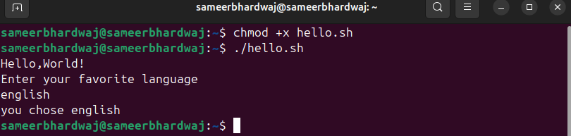
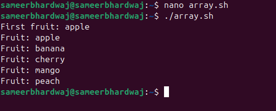
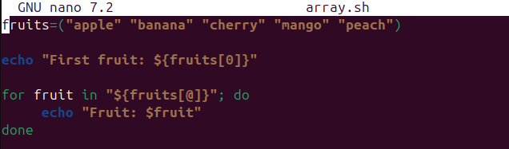

# **Assignment 2 – Script Execution & Explanation**

## **Objective**
Understand how existing scripts in `Scripts/` work.

---


## 🔹 User Input

Read input from user with `read`.

```bash
#!/bin/bash
echo "Enter your favorite language:"
read lang
echo "You chose $lang"
```
### **IMAGE**


## 🔹 Arrays

## Purpose

This script demonstrates how to loop through an array and print its elements.

```bash
fruits=("apple" "banana" "cherry")

echo "First fruit: ${fruits[0]}"

for fruit in "${fruits[@]}"; do
    echo "Fruit: $fruit"
done
```

## Line-by-Line Explanation

`#!/bin/bash` → Runs the script using Bash.

`arr=("apple" "banana" "cherry")` → Declares an array with 3 elements.

`for item in "${arr[@]}"` → Loops through each element of the array.

`do` → Starts the loop body.

`echo $item` → Prints the current element from the array.

`done` → Ends the loop.



---

# 📌Extra Questions:

### ❓What is the purpose of #!/bin/bash at the top of a script?

Ans-👉 `#!/bin/bash` ensures the script is always run with Bash, regardless of the user’s default shell.

### ❓How do you make a script executable?

Ans-To make a script executable:

Write your script (e.g., `myscript.sh`).

Give execute permission using `chmod`: