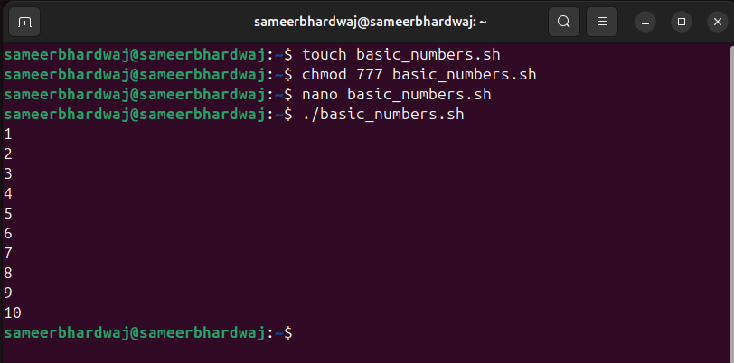
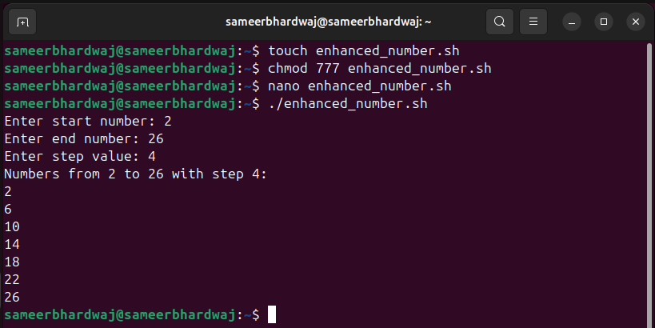

# **LAB 3 – Modify an Existing Script**

## Objective
Enhance and customize an existing script to allow user-defined input and validation.

---

## Original Script: `basic_numbers.sh`
- The original script printed numbers from 1 to 10 in order.
- It did not accept any user input.

## Example-

 ```bash
  #!/bin/bash
  for i in {1..10}
  do
      echo $i
  done
  ```



## Modified Script: `enhanced_numbers.sh`

### 📌 New Features:

### (1) User provides:

- Start number

- End number

- Step value

### (2) Input validation:

- Ensures values are integers

- Ensures step is a positive integer

### (3) Prints numbers based on user input instead of fixed range.

## 👉 enhanced_number script-

```bash

#!/bin/sh


echo -n "Enter start number: "
read start
echo -n "Enter end number: "
read end
echo -n "Enter step value: "
read step

case $start in
    ''|*[!0-9-]*) echo "Error: Start must be an integer." ; exit 1 ;;
esac
case $end in
    ''|*[!0-9-]*) echo "Error: End must be an integer." ; exit 1 ;;
esac
case $step in
    ''|*[!0-9]*) echo "Error: Step must be a positive integer." ; exit 1 ;;
esac

if [ "$step" -le 0 ]; then
    echo "Error: Step must be greater than 0."
    exit 1
fi

echo "Numbers from $start to $end with step $step:"
i=$start
while [ "$i" -le "$end" ]
do
    echo "$i"
    i=$((i + step))
done
```
# **image-**



# **Conclusion**

### - Original script was static, always printing 1–10.

### - Enhanced script is dynamic, accepts user input, validates it, and prints custom ranges.

### - This makes the script more flexible and user-friendly.

# **📌 Extra Questions:**

### ❓ Difference between $1, $@, and $# in bash?

Ans- ✅ Quick Summary:

It controls positional parameter

- $1 → First argument only

- $@ → All arguments (separately, safe for spaces)

- $# → Number of arguments

### ❓ What does exit 1 mean in a script?

Ans- 👉 In short:

- exit 0 → success

- exit 1 (or other non-zero) → error / abnormal termination


