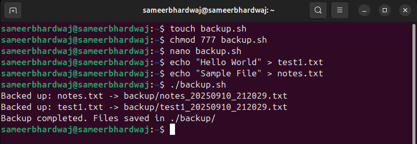
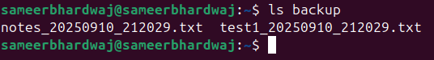

# **LAB 5 – File & Backup Automation**

## **Objective**
Automate backup of `.txt` files by copying them into a backup folder with a timestamp.

---

## **Script:** `backup.sh`

### Steps:
1. Creates a folder named `backup` if it doesn’t exist.
2. Generates a current timestamp in format `YYYYMMDD_HHMMSS`.
3. Loops through all `.txt` files in the current folder.
4. Copies each file into the `backup/` folder.
5. Appends the timestamp to the filename for uniqueness.

---

## Example Run

### Input
Files in the current folder:


### Running script
```bash
$ ./backup.sh
Backed up: test1.txt -> backup/test1_20250910_201530.txt
Backed up: notes.txt -> backup/notes_20250910_201530.txt
Backup completed. Files saved in ./backup/
```
# **images-**



# **Conclusion**

### - The script ensures .txt files are safely copied with timestamps.

### - Each backup run creates uniquely named files, avoiding overwriting.

### - This simple automation can be extended for more file types or scheduled backups.

# **📌 Extra Questions**

### ❓What is the difference between cp, mv, and rsync?

Ans- 👉 In short:

- Use cp for a quick copy.

- Use mv when moving/renaming.

- Use rsync for smart backups, syncing, and large data transfers.

### ❓How can you schedule scripts to run automatically?

Ans- ✅ Summary

- Use `cron` for recurring jobs.

- Use ``at for one-time jobs.

- Use `systemd timers` if you want logs and reliability.

- Use a loop with sleep only for quick tests.