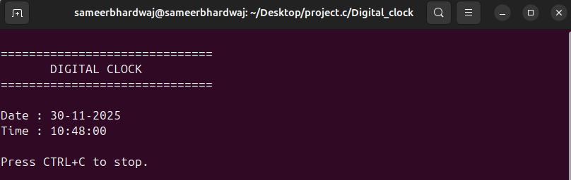
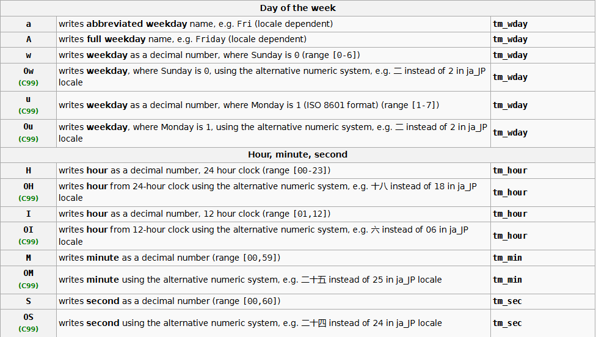

# **⏱️Digital Clock in C (Linux Compatible) – Report**

## **🌠Introduction**
A digital clock is a simple yet effective demonstration of how computer programs can interact with system time and continuously update output in real-time.  
In this project, we develop a **Linux-compatible digital clock in C** that displays the **current time, date, and day of the week**. The program uses standard C libraries such as `<time.h>` to fetch system time and `<unistd.h>` for timed delays.  
ANSI escape codes are used to clear the terminal screen without relying on external system calls, making the program efficient and portable across Linux environments.  
This clock runs continuously and refreshes every second, providing a real-time digital display similar to a terminal-based gadget.

---
## **🛠️Question**
Write a C program to create a **digital clock** that is **Linux compatible**.  
The program should:  
- Continuously display the **current time**, **date**, and **day of the week**  
- Update automatically every second  
- Use **ANSI escape sequences** to clear the screen (instead of `system("clear")`)  
- Display the output in a clean, formatted layout

---
## **💻Code**
```bash
#include <stdio.h>
#include <time.h>
#include <unistd.h>
#include <stdlib.h>

int main() {
    while (1) {
        time_t now = time(NULL);
        struct tm *t = localtime(&now);

        // clear screen (ANSI clear)
        // works in most Linux terminals
        printf("\033[2J");      // clear entire screen
        printf("\033[H");       // move cursor to home (top-left)

        printf("====================================\n");
        printf("         DIGITAL CLOCK (Linux)\n");
        printf("====================================\n\n");

        // print date
        printf("Date : %02d-%02d-%04d\n",
               t->tm_mday,
               t->tm_mon + 1,
               t->tm_year + 1900);

        // print time
        printf("Time : %02d:%02d:%02d\n",
               t->tm_hour,
               t->tm_min,
               t->tm_sec);

        fflush(stdout);

        sleep(1);
    }
    return 0;
}
```
## **🧪Output**
<video controls src="images/digi_clock.mp4" title="Title"></video>

---

---
## **✅What It Does**

- Uses `time()` and `localtime()` from `<time.h>` to fetch the current system date and time.



- Clears the terminal screen using **ANSI escape codes** (`\033[2J` and `\033[H`) to refresh the clock in place.
- Updates the display every second using `sleep(1)` from `<unistd.h>`.
- Runs continuously in an infinite loop until the user stops the program with **CTRL+C**.

---
## **🎯Conclusion**

The Linux-compatible digital clock program demonstrates how C can interact with the system’s real-time clock using standard libraries like `<time.h>` and `<unistd.h>`. By refreshing the terminal using ANSI escape codes, the program provides a smooth, continuously updating display without relying on external commands. This project reinforces concepts such as time handling, infinite loops, terminal control, and real-time output formatting. Overall, it serves as a practical example of how low-level programming can be used to create functional and dynamic console-based applications.

---


