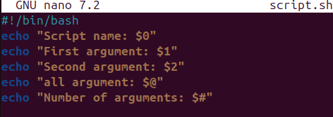

# **🐚 Shell Scripting Tutorial!!**
### Shell scripting allows you to automate tasks in Linux/Unix by writing commands inside a file that the shell executes line by line.

### 1. 🔹 What is a Shell Script?
A shell is a command-line interpreter (e.g., bash, zsh, sh).
A shell script is a text file with a series of commands.
File usually has .sh extension, though not mandatory.

### Example: hello.sh

```bash
#!/bin/bash
echo "Hello, World!"
```
Run it:

chmod +x hello.sh   # make it executable
./hello.sh
Output:

Hello, World!

# **IMAGE**


----

## 2. 🔹 Variables

Variables store data (text, numbers, paths, etc.).

### Defining variables

```bash
name="sameer bhardwaj"
age=18
```

⚠️ No spaces around `=`.

### Accessing variables

```bash
echo "My name is $name and I am $age years old."
```

Output:

```
My name is sameer bhardwaj and I am 18 years old.
```
# **"IMAGE"**


----

## 3. 🔹 User Input

Read input from user with `read`.

```bash
#!/bin/bash
echo "Enter your favorite language:"
read lang
echo "You chose $lang"
```
### **IMAGE**


---

## 4. 🔹 Conditional Statements (if-else)

```bash
#!/bin/bash
num=10

if [ $num -gt 5 ]; then
    echo "Number is greater than 5"
else
    echo "Number is less than or equal to 5"
fi
```

Operators:

* `-eq` (equal)
* `-ne` (not equal)
* `-gt` (greater than)
* `-lt` (less than)
* `-ge` (greater or equal)
* `-le` (less or equal)

### **IMAGE**


---

## 5. 🔹 Loops

### For loop

```bash
for i in 1 2 3 4 5
do
    echo "Number: $i"
done

```
### **IMAGE**


Or use a range:

```bash
for i in {1..5}
do
    echo "Iteration $i"
done
```

---

### While loop

```bash
count=1
while [ $count -le 5 ]
do
    echo "Count: $count"
    ((count++))   # increment
done
```
### **IMAGE**


---
### Until loop

Runs until condition becomes true.

```bash
x=1
until [ $x -gt 5 ]
do
    echo "Value: $x"
    ((x++))
done
```


---

## 6. 🔹 Functions

Encapsulate reusable code.

```bash
greet() {
    echo "Hello, $1"
}

greet Vibhu
greet World
```

Output:

```
Hello, Sameer
Hello, World
```


---

## 7. 🔹 Command Line Arguments

Access arguments passed to script:

```bash
#!/bin/bash
echo "Script name: $0"
echo "First argument: $1"
echo "Second argument: $2"
echo "All arguments: $@"
echo "Number of arguments: $#"
```

Run:

```bash
./script.sh apple banana
```



----
## 8. 🔹 Arrays

```bash
fruits=("apple" "banana" "cherry")

echo "First fruit: ${fruits[0]}"

for fruit in "${fruits[@]}"; do
    echo "Fruit: $fruit"
done
```


---
## 9. 🔹 Useful Commands in Scripts

* `date` → show current date/time
* `whoami` → show current user
* `ls` → list files
* `pwd` → print working directory
* `cat` → read file contents

---


