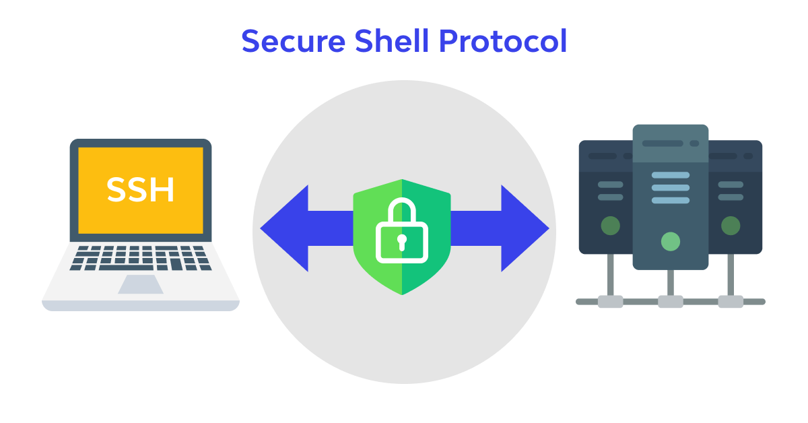
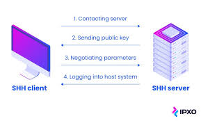
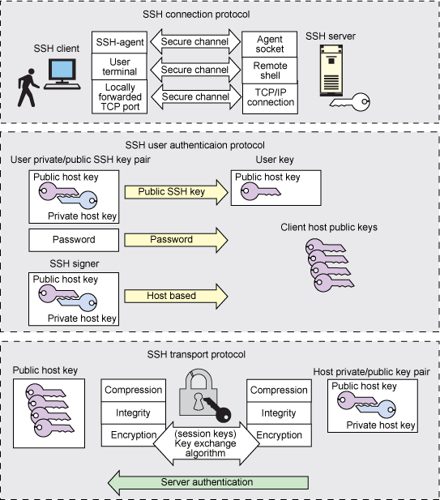

# **Secure Shell (SSH) - Technical Documentation**

## **Introduction**
✨Secure Shell (SSH) is a cryptographic network protocol used for secure communication between two networked devices. It provides a secure channel over an unsecured network using encryption, making it a preferred method for remote system administration and secure file transfers in Linux environments.


---

## **Why SSH?**
✨SSH replaces older, insecure protocols like **Telnet**, **rlogin**, and **FTP** by encrypting all traffic. This prevents attackers from reading sensitive information like login credentials.



---

## **SSH Architecture**
✨SSH works using a **client-server model**:
- The SSH **client** initiates a secure connection.
- The SSH **server** (sshd daemon) listens for incoming requests on port **22**.



---

## **Basic SSH Commands and Their Usage**

### **1. Connect to a Remote Server**
```bash
ssh username@remote_ip
```
- Establishes a secure shell session with a remote machine.

## **2. Connect on a Custom Port**
```bash
ssh -p 2222 username@remote_ip
```
- Used when the server listens on a port other than the default 22.

## **3. Execute Single Command on Remote Server**
```bash
ssh username@remote_ip "ls -l"
```
- Runs a command directly without opening an interactive shell.

## **4. Generate SSH Key Pair (Passwordless Login)**
```bash
ssh-keygen -t rsa -b 2048
```
- Creates a public/private key pair for secure login.

## **5. Copy Public Key to Remote Server**
```bash
ssh-copy-id username@remote_ip
```
- Enables passwordless authentication using SSH keys.

## **6. Secure File Transfer Using `scp`**
```bash
scp file.txt username@remote_ip:/home/username/
```
- Securely sends files to a remote server.

## **7. Download File from Remote Server Using `scp`**
```bash
scp username@remote_ip:/home/username/file.txt .
```
- Transfers files from remote to local system.

## **8. Sync Files/Directories Using `rsync` over SSH**
```bash
rsync -avz file.txt username@remote_ip:/home/username/
```
- Faster file transfer using compression and incremental copy.

## **9. Secure File Transfer Using SFTP**
```bash
sftp username@remote_ip
```
- Opens an interactive secure file transfer session.

## **10. SSH Tunneling (Port Forwarding)**
```bash
ssh -L 8080:localhost:80 username@remote_ip
```
- Forwards local port 8080 to remote port 80 (used for secure tunneling).

## **11. Check SSH Version**
```bash
ssh -V
```
## **12.sudo systemctl restart ssh**
```bash
sudo systemctl restart ssh
```
- Restarts SSH daemon service.

## **SSH Configuration File**

**Location:** `/etc/ssh/sshd_config`

### **Common Settings**

| Option | Description |
|---------|--------------|
| Port 22 | Change default SSH port |
| PermitRootLogin no | Disable root login |
| PasswordAuthentication no | Allow only key-based authentication |
| AllowUsers user1 user2 | Restrict SSH access |

---

### **Advantages of SSH**

- Encrypted communication ✅  
- Secure remote administration ✅  
- File transfer support ✅  
- Port forwarding ✅  
- Strong authentication ✅  

---

### **Common SSH Errors and Fixes**

| Error | Cause | Solution |
|-------|--------|-----------|
| Connection refused | SSH service not running | `sudo systemctl start ssh` |
| Permission denied | Wrong user or key issue | Check username or permissions |
| Timeout | Firewall blocking SSH | Allow port 22 in firewall |

---

### **Conclusion**

✨SSH is an essential tool for secure remote access and file transfer in Linux systems. It provides strong encryption and flexible authentication methods, making it vital for system administrators and developers.

