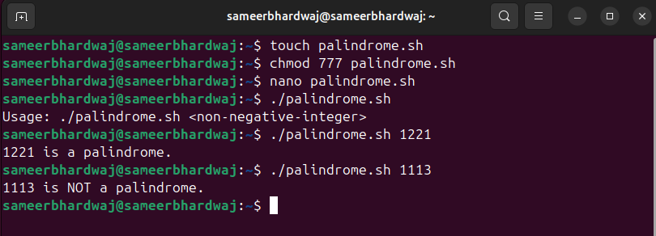

# **Experiment: Palindrome Number in Shell Script**

## **Aim**
To write a shell script to check whether a given number is a palindrome or not.

## Algorithm
1. Start.
2. Read a number from the user.
3. Store the number in a temporary variable.
4. Reverse the number using a loop:
   - Get the last digit using modulo operator (% 10).
   - Append it to the reverse variable.
   - Remove the last digit using integer division (/ 10).
5. Compare the reversed number with the original number.
6. If both are the same → the number is a palindrome.
7. Else → not a palindrome.
8. End.

## Shell Script: `palindrome.sh`

# Experiment: Palindrome Number in Shell Script

## Aim
To write a shell script to check whether a given number is a palindrome or not.

## Algorithm
1. Start.
2. Read a number from the user.
3. Store the number in a temporary variable.
4. Reverse the number using a loop:
   - Get the last digit using modulo operator (% 10).
   - Append it to the reverse variable.
   - Remove the last digit using integer division (/ 10).
5. Compare the reversed number with the original number.
6. If both are the same → the number is a palindrome.
7. Else → not a palindrome.
8. End.

## Shell Script: `palindrome.sh`
```sh
#!/bin/bash

echo "Enter a number:"
read num

temp=$num
rev=0

while [ $num -gt 0 ]
do
    digit=$(( num % 10 ))
    rev=$(( rev * 10 + digit ))
    num=$(( num / 10 ))
done

if [ $temp -eq $rev ]
then
    echo "$temp is a Palindrome number"
else
    echo "$temp is NOT a Palindrome number"
fi
```
# **image**


# **Excel representation of working of loop**


---
